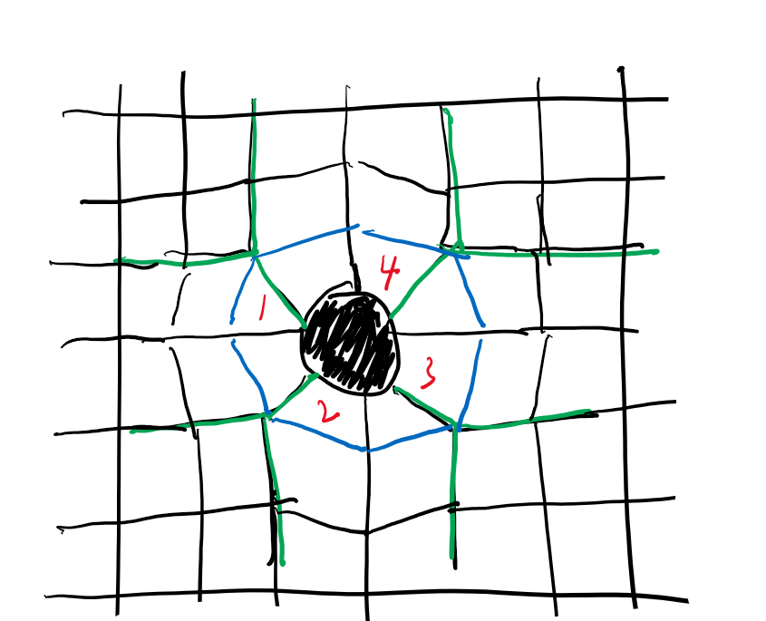
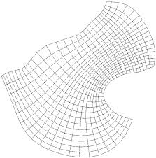

# 时空的形状
凡是物质附近出现拉伸现象的，不管是哪个方向，纵向、横向、斜向，都是不对的。

## 这个图形不错。但也不对
curvilinear grid
因为他的网格数量是相等的，感觉时空的网格数量应该是不相等的。

为什么我做不出来呢？

靠近物质的区域，网格的数量一定是增加了。因为空间如果整体平直，靠近物质被缩小，
不靠着增加，很难变回平直。 而且如果有挤压效应，多半有增加。

单元格的缩小，也是很直观的事情。用过大的单元格体现

- 时空是否是刚性较强的海绵，被物质挤压、传导？如果只是被挤压，它是什么形状的？
- 还是物质确实创造了新的时空？并且创造和挤压的比率是相同的？
- 物质应该并没有排开时空，和水、空气的类比都不太像。因为物体有空洞，时空就会进来。而且等比例变化。
水和空气不会这样。海绵更不会。海绵流不进来，空气则似乎没有密度变化。空气的对密度的重构能力更强。

空间的缝隙应该需要用增加的度量来填充，它就是多出来那么一块儿。就像多层砖拱形一样。每一行的数量必然不一样。
如果一样，那砖块的数量就会一致，变形就会一直持续下去，而可以肯定变形不能持续下去。

这说明各个单元的坐标线是对不齐的。或者宇宙会不会根本就没平直这回事,时空单元本就是物质散发出来不断扩散的东西？
然后各个物质的时空搅和在一起？这个感觉不太好。

还是空气这种比方更很有希望一些。只是时空的力量应该强于空气，没那么容易被挤压？如果时空是空气或者弹性液体，
空气或者海绵的传导性很差，它的一个小区域很容易被压缩，然后这种作用就没了。时空的微小变形，说明它的每个区域
的可压缩性要小得多。
那就应该不需要创造新的时空单元。只需要缩小物质附近的时空单元就行，这种传导性如何描述？

如果从半径开始进行变形，那么很奇怪，为什么最终可以变成平直？这是很奇怪的。距离足够远，单元格会变成固定大小
但这样，围成的区域一直是环形，怎么恢复成平直形状呢？

每个点可以直接找到一个对应点。没必要通过累加求出对应点。虽然距离单元的变化不同，但这种不同
是有规律的。下一个变化与上一个单元的变化之间有函数关系。

直接取出x,y 再对x,y变形，这样为什么不行？因为x,y的位置是错的，施加的变形与位置有关，所以说对x,y施加
的变形是不对的。x,y的原始位置并不在它的行与列所标定的那个位置，而是在它的行与列所标定的那个点的与圆心
的连线间的某一点上。

算好一行的起始列度量值，后面逐渐修改这个度量 这样不行。因为后面的同一行的不同列，度量都不相同
只有按半径计算，度量变化才相同。但怎么样才能让这个圆形变成平直呢？！！！

如果用多层砖砌一个拱形，每一层所需要的砖的数量肯定是不一样的。砖甚至可以切一下，切成楔型，还可以用
大小不同的砖，但问题是最后总会恢复成方形。这个过渡到底是怎么完成的？这些时空的缝隙，是怎么消失的？

用极坐标的形式是不对的。环形的砖不能无限的变大。

总觉得如果从上边和右边开始画单元格，每个点按比例缩小，圆心方向会空出一个圆形。因为每个四方格会变形，刚好
弥补时空的缺陷。

但这个过程，从圆心开始绘制四边形，应该也是可以达到的。为什么不行呢？

所以从原点出发，逐个方向累加，是一个简单的方法，但这个方法没有函数化呀。
随着与圆心距离的增加，度量在逐渐的恢复到1。
但整个时空的形状如何恢复呢？又如何实现多添加几个单元格呢？

那问题到底出在哪里？

从原点出发，按既定长度（高度和宽度）向外均匀的绘制方格（正方形），但同时对方格根据到原点
的距离，施以指数变形。绘制两遍，应该就能得到时空的形状。

物质所在的区域原本只有四个单元格。或者是物质创造了单元格，或者是
挤出了原有的单元格，或者都有，造成了物质所在区域及周围单元格的变形

从图上看，创造新单元格的可能性更大。

空间的新增或者变形，从几何来看，是借用或者生成新的坐标线。
在图中，如果认为绿线是吸引合并到物质，蓝线则一定是新增的，
而且新增的数量多于合并的数量

由此看来，直接对网格变形，是达不到这个效果的，必须有新增才可以。

## 具体的问题
### 怎么解释重力加速度？
从原点开始出发运动的物体，为什么会返回原点？

解释弯曲好像相对容易。45度线很容易变成圆形，直线很容易变成甩出去的线。
但是往圆心回落是怎么形成的呢？

### 为什么没有出现恢复平直的现象？在圆心处要增加网格吗？
是不是应该记录累计缩小的情况，当累计缩小达到一个单元的时候，增加一个单元？
但这样用行列的方式绘制就是不对的。因为这样没法体现出斜的方向

### 如何绘制
如果想把时空的形状绘制出来，需要搞清楚增加的到底是多少。然后，沿着物质的边界，均匀的增加
按层增加这些单元格。就像拱门那样。

每一层都应该增加，每一层增加数量逐渐减少。

空气中是没有单元格的，没有这个恼人的问题。

或者就设计一个单元格的增加数量（宽度的衰减，增加越多，宽度越窄）的和高度宽度的衰减规则，就可以绘制出想要的形状了。

世界本来是很简单的，是我们的数学工具不行，人类的描述能力不行，或者我自己数学不行。数学虽然能用一个公式
写出大范围的变化，但运算起来还是复杂。

也许直接画格子还简单。根据距离物质的距离，计算格子四个点的坐标。排满为止。可以先计算一下，根据高度宽度的
缩放，能排多少个格子。然后再绘四边形（从不规则四边形渐变到正方形）

世界是简单的，他肯定不会在一个粒子的微小运动之前先做一通花里胡哨的运算。它会采用最简单的规则运算。

#### 用极坐标？
只要把点（x,y）朝着圆心方向移动后，算出新的x,y就可以。这其实就完成了高度和宽度的缩小。一个圆环往圆心
方向缩小，影响是双方面的。圆环的高度和宽度都会缩小。r变小，弧度不用变。

但这样有点奇怪。一个圆心，同向的圆环数量不会有增减。难道弧度也要跟着缩小？那这个缩小的比例是多少呢？

极坐标的问题出在哪里？确实纵横方向都在压缩，但为什么单元数目是不变的？但如果极坐标的刻度不均匀，相同区域单元数量又不一样。
### 时空单元，是仅仅挤出，还是创造了新的？
有可能增加和变形都是有的。

或者先仅仅按照排开时空的数量来计算。虽然公式没有，但可以测量，可以慢慢总结公式。

这个排开多少，仍然是个问题，排开之后，内部是什么呢？物质的有形的界限肯定不对，像地球这样的物体，
挖个洞进去时空仍然存在。对于星云、星系这样的东西来说就更是如此。你可以直接进入内部。

应该是创建了新的。如果仅仅是挤出，那就一定有一个区域没有时空。怎么找到这个没有时空的地方呢？边界又在哪里呢？对于星云、空气一样
的物体，你可以穿过它的中心也不会遇到没有时空的地方。

甚至创建的说法也是不对的。所有位置的物质都在创建时空，而不是只有中心点在创建。只是时空密度应该有一个最大值。
超过这个最大值的部分就会向外膨胀，就像气体一样，应该是不能无限压缩的。

应该是创建了无限趋近于0的时空单元，这些时空单元有挤压了外面的时空单元，这样解释才能说得通。

新的时空单元看起来像是从一个点发出的，但永远不会找到这个点。这个点是极限值。
## 时空有没有挠率？
这个问题不好说。 但应该可以通过测量来判断。如果有无挠率的变形所不能解释的问题，就可能是有挠率。
即变形除了在我们知道的纬度，还可能在我们不知道的维度。

想象曲面在三维的形状，应该有所启发。

# 时空形状的原始版本
单单考虑网格的拉伸是不行的。物质的出现，似乎增加了网格。但网格都变小了。

物质应该是可以创造时空。但这部分时空我们进不去。但它却会挤压外面的时空。让外面的时空时间比正常慢，距离比正常短
黑洞附近的人，可以获得漫长的生命，它感觉自己以正常的时间、正常的频率做事情，但遥远观测者会认为他基本上静止不动

他移动的短短的距离，外人看来要几百年或是永远。

从运动者的角度来看，他的尺子会随他所处空间成比例的缩小。而他的时间会与他所处的空间成比例的变慢。这样，他通过
相同距离（如果他自己能测量），所用的时间是不变的。黑洞在运动者看来是没有尽头的巨大。他用相同的速度，永远走不到头。
（但其实他有加速度）

但外人看到的整个黑洞是很小的，这样遥远的观测者会认为运动者用漫长的时间只移动了很小的距离。

它挤压的量等于他创造的量。

没有黑洞，黑洞是一个极限值。我们只能无限接近，却无法到达。我们在到达一个物体在它的黑洞边界之前就会到达它
的物质边界。

在物质附近，各个维度都要压缩，才能在排开的时空空洞中，摆放原来同样数目的时空单元。

时空与空气应该是惊人的相似。一个物体会排开空气，造成空气的变形。尽管它本身不是空气。
物质周围的时空单元都变得比原来小。所有变小区域的总和，应该等于它多创造出来的那一块区域。

这与热板的膨胀略有不同。热板的膨胀，是某些区域变大了。时空变形则不是这样。是所有区域
都变小。物质应该是凭空创造了时空。

但最后对边缘区域的挤压效应是相同的。热板的某些单元变大，而整块板不变大，扣除三维方向
的变形，一定会挤压其他区域。

如果想正确绘制时空的形状，物质周围应该没有直线。只有曲线。原本的坐标线中的直线要变成曲线
或者说，变成物质的形状

如果时空是空气一样的弹性物质，假设空气中原来有坐标单元格，受到挤压它只会变密集，变小，
但不会凭空创建出新的读数。它原来是度多少读数，就是多少读数，只是读数可能会变得更密集。

但这个还是可以做到一个边界区域所有的单元格都缩小。因为物质所在区域的单元格被挤压出来了，有
更多的单元格填充原来的区域，那就只能所有单元格都缩小。而且应该是纵向横向都缩小才对。但现在用
极坐标半径伸缩，只能缩小半径方向，不能将多出来的单元格排布在圆形的周围。也就是说，只能实现
半径所指向的方向压缩，而不能实现垂直于半径方向的压缩。这应该是不对的。

不能把0,0这个格点一下次推出去，这样是不对的。这样肯定导致这个格点被放大。而时空变形没有放大效应，
只有挤出效应。

要无限细分这些格点再推出去。

物质为什么能够创造时空，能够创造多少？有什么样的公式可以计算出来？

.png)

我们的时空，像是被物质所吸引着，朝着物质的方向塌缩。物质周围的时空，与物质的体积
的大小并没有关系，而是和物质的质量有关系。物质使得它周围的时空朝着他压缩。

物质甚至没有边界，它所在的位置就是中心。

如果用一个二维平面的变形来想象时空的变形，到底是物质的存在创建了多余的时空，导致现有的时空向外挤压，
还是物质的存在吸走了一部分时空，导致周围的时空被拉伸？

感觉更像是前者，物质可以创造时空，但它创造的那部分我们进不去。它创造的边界导致了外围时空的变形。
距离越近，变形越强，距离越远，变形越弱。

物质越多，变形越强。但它的边界在哪里？并不是物质的实体形状是它的边界。把地球挖个洞，洞里面依然存在时空。
有一个类似于数学上的极限值。那个极限就是时空的边界。在极限里面，似乎没有时空？也就是黑洞？

那么时空与这个所谓的内部的交界，是如何定义的？只能假定有一个边界。或许可以计算出来。多少物质，能够凭空
创造出多少时空，那些必须容纳的时空就是平直时空开始的位置，时空挤压效果从这里开始，向外传导物质越多，传导的
越远。

原来的时空是会被挤压到一个新的位置的

# 复变函数
复数的加减乘除，和向量的加减乘除是一样的。所以如果要求复变函数的结果，需要用向量算法来算。

用极坐标思考复数运算，也许有点新的启发？ x是模长，y是角度。那复数加法和向量加法的结果是否一致？好像不太对。

模长加模长就肯定不对了。两个向量相加没有那么长。

# 广义相对论与黎曼几何的不同
其实在平面上定义一条曲线，并研究曲线上的运动规律和在三维中定义一个曲面，并研究曲面上的运动规律是一样的

但这两者和广义相对论所谈的变形又好像不太一样。广义相对论相当于是在平面上研究平面的局部变形（拉伸，缩小）
对三维而言，就是三维平直系统中的某个局部的膨胀，压缩
对四维而言也是一样。

这样的系统和在三维中研究曲面有个很大的区别就是它是没有挠率的。最恰当的比方是在一个平面系统中，只是沿着x,y方向
会发生变形，而不产生z方向的变形。

所以广义相对论用到的数学还相对简单一些。

# Christoffel Symbol的直观、具体的作用
我感觉Christoffel符号，是用来描述坐标系的移动的。就是说一个向量如果移动的话，怎么样才算保持不变（就是说要自动加减这些变化）

但现在还不能把这些量给对应起来。没办法讲清楚雅克比矩阵式谁相对谁，描述的是谁的变化？还有Christoffel Symbol到底具体是怎么指导
向量变化的？

## 不要误入歧途
用曲面几何去解释广义相对论，有个地方很需要注意，就是挠率。更直观的说，用三维空间去描述一个不平的曲面，用这种方法描述广义相对论
所讲的时空弯曲，这是不对的。

广义相对论里面不一定有这样一个曲面方程。

广义相对论只需要二维到二维，三维到三维，四维到四维。而且都是简单的局部坐标变换，不需要类似于极坐标到二维笛卡尔（完全不同）、
球坐标系（二维曲面）到三维笛卡尔这样的变形坐标系（不但少了一维，而且还是两种体系）

可以考虑用极坐标或者球坐标来描述变形。那样描述变形会更容易一些。但变形的极坐标和原来的笛卡尔坐标之间的转换关系怎么算？没有一个
类似的度量张量的定义。

度量张量只是针对笛卡尔坐标系的。不过这样说，似乎支持任意坐标系到笛卡尔坐标系的转换。因为局部的转换关系总是确定的。极坐标、球坐标
这种还更好，有整个空间的转换关系。虽然具体的矩阵不同，但可以用相同的函数形式来描述。这就是函数空间或者泛函一类的东西的威力吧？

如果先把笛卡尔坐标转换成极坐标，然后变形，再把变形结果转换回笛卡尔坐标，也许这样可以很容易的找到圆形物体嵌入二维平面之后导致的
二维平面的变形。

## 球坐标系和曲面坐标系并不相同。球坐标系是没有限制的。曲面坐标系才有。

我觉得用曲面去描述广义相对论的时空是错误的。因为曲面里面有挠率。广义相对论的变化要更简单一些。

# 未解的问题
还需要解释好除了轨道运动，自由落体的加速运动又是什么？
