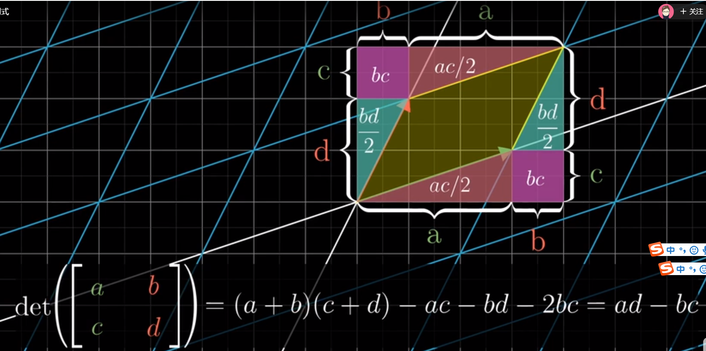

# 矩阵（矩阵 * 矩阵，矩阵 * 向量）乘法
M * a = b有两种理解方式，
## 第一种
将M视为一个全新独立坐标系，a是某个向量在这个坐标系的分量，b则是同一个向量在笛卡尔坐标系的读数

斜角坐标系（由M确定）中的向量读数(x,y),表示它是基向量g1的x倍，g2的y倍，分别计算后，得到两个向量
的笛卡尔读数，再由向量加法，得到这个向量的笛卡尔读数

我觉得这个方法更简单、直观，容易理解。
## 第二种
将M视为对笛卡尔坐标系的变形。也就是《线性代数的本质》中的方法。
a是笛卡尔坐标系下的某个向量。b是这个向量随着基向量变形（也就是整个坐标系的变形）后
得到的向量（a,b的读数都是笛卡尔读数）

这种理解也许对理解逆矩阵有好处。

## 矩阵与矩阵相乘
矩阵相乘，按线性代数的本质，可以理解为两次变换，相继作用于基向量。这个是好理解的。
那么度量张量可以认为是连续作用于i,j的两个矩阵相乘的结果。与第一个矩阵相乘，得知i,j分别去了什么地方
```
e, g
f, h
然后再用另一个矩阵
a c
b d
与这个矩阵相乘，那么接下来i到了这个位置
a  * e  + c * f
b         d

即基向量i最终的位置是
a*e+c*f
b*e+d*f
基向量j的最终位置是
ag+ch
bg+dh 
```

这个还是可以用第一种方法，即坐标变换而不是对基向量的变形来理解。两个矩阵连乘，应该是把某种读数
的转换成笛卡尔读数。

# G, G.I、G.dual、度量张量
这个概念之间的几何联系是什么样子的？
## G 
### 定义
以两个基向量的笛卡尔读数为列构成的矩阵，
### 作用
可以将斜角坐标系的读数转换成笛卡尔读数

## G的逆矩阵
### 作用
将向量的笛卡尔读数转换成斜角坐标系的读数， 

或者说，将被斜角坐标系变形的向量变回原来的样子。将G理解成变形矩阵，还不如将它理解为一个独立的绘制在
笛卡尔坐标系中的另外一个坐标系。变形有点麻烦。

## 度量张量
度量张量如果作为中间工具，好理解，但它本身有没有几何意义？
### 作用
- 将向量斜角坐标读数的点乘，转换成笛卡尔点乘。
```
(x,y) @ G.T @ G (x, y).T
```
这里面，为什么(x,y)@G.T = G@(x,y)?
```
这个其实理解为凑答案也可以。最原始的定义，就是先把斜角读数转换成笛卡尔读数再点乘
即
G@(x,y) * G@(x,y)

但这样没办法独立的保存两个G。不方便抽取为一个新的独立的东西形成公式，方便以后运算

那再看(x,y)@G.T， 展开，观察这个算式
(x,y) * g1x,g1y  = x*g1x+y*g2x, x*g1y+y*g2y = x(g1x,g1y)+y(g2x,g2y) 
        g2x,g2y

正好符合向量加法的定义， 所以，就把 (x,y) @ G.T @ G @ (x,y).T 作为斜角坐标系
下面的长度公式。吧G.T @ G成为度量张量。 矩阵运算不能交换，但结合是可以的。
```
- 将斜角坐标转换到它的对对偶坐标系（即指标升降）。为什么它能够将斜角坐标读数，转换成对偶坐标系的读数？
这是个代数巧合，还是有几何原因？要看看对偶坐标系的定义，和逆矩阵的定义

### 公式
- 第一个公式好理解。就是一个中间量。先分别将斜角坐标读数转换成笛卡尔读数，再点乘
```
G.T@G
```
- 第二个
```
g1@g1 g1@g2
g2@g1 g1@g1
``` 
其实这和第一个是一回事。G.T， 就是第一行是g1,第二行是g2。那么G.T@GT,就可以写成
```
g1x g1y      g1x  g2x
g2x g2y   *  g1y  g2y 

注意，乘号两边是两个矩阵，那么按照矩阵乘法就是
(g1x,g1y) @ (g1x,g1y), (g1x,g1y) @ (g2x,g2y)
(g2x,g2y) @ (g1x,g1y), (g2x,g2y) @ (g2x,g2y)
即
g1@g1, g1@g2
g2@g1, g2@g2 
```

## 对偶坐标系 
### 公式
这个公式不好理解。为什么是这个样子呢？ 特别是为什么要转置一下子？

为什么向量的斜角坐标的读数，左乘度量张量能得到对偶坐标的读数呢？这是个代数运算的巧合还是有什么意义？

```
G.I.T
```

## 其他问题
- 为什么一个斜角坐标系的对偶坐标系是它的两个基向量的笛卡尔读数矩阵的逆矩阵的转置呢？这是什么含义？
- 为什么g1\*g_2=0, g2\*g_1=0, g1\*g_1=1, g2*g_2=1, 根据这个定义，可以得出来对对偶坐标系的
基向量的矩阵，是当前斜角坐标系的基向量构成的矩阵的逆矩阵的转置呢？
- 为什么用斜角坐标系的读数左乘度量张量，可以得到对偶坐标系的坐标读数？用变形理解度量张量有点问题，因为输入不是笛卡尔读数。


# 逆矩阵
## 逆矩阵的几何意义
逆矩阵的几何意义，也可说是消除坐标变形

只有逆矩阵，没有逆向量。逆矩阵是对斜角坐标系的基向量的反向操作，如果g1在x方向放大a倍，逆矩阵则缩小a倍，
如果基向量移动了x轴，则逆矩阵要讲x轴移动回去。

## 逆矩阵和矩阵除法
感觉逆矩阵就是矩阵的除法。一个算式除以某个矩阵，等价于它乘以这个矩阵的逆矩阵。
## 求逆矩阵的方法
但逆矩阵的运算颇为复杂，因为你对一个基向量的一个分量的变动，还会影响另一个基向量的分量，所以不是直接修改基向量的分量那么简单。

可以这样理解逆矩阵的运算：根据M * a = I * b，可以想象，求M的逆矩阵，就是尝试对I变形，即

M-1 * M * a = M-1 * I * b

即当a = M-1 * I * b 的时候，就找到了M的逆矩阵M-1。这相当于对b的坐标系也就是单位矩阵变形，然后记录这个变形。

这样更容易，因为对笛卡尔坐标系的变形进行追踪比对斜角坐标系进行追踪容易多了。

这个情况下逆矩阵的求结果过程也许可以变成解方程组。但似乎对于第一种理解，通过勾股定理猛算就能得出逆矩阵。把两个基向量缩放旋转回i、j就可以了？
但各处的资料显示不是这么简单。


# 行列式和以及逆矩阵的计算
行列式的本质就是坐标系变形时，单位矩形i*j的面积的变化倍数。行列式的公式，看来只是一个巧合。  


但它为什么和逆矩阵有关系？下面的文章讲得很好！但涉及了伴随矩阵和代数与余子式
https://www.zhihu.com/question/301361922 

### 伴随矩阵和代数余子式
是什么东西？  
https://www.shuxuele.com/algebra/matrix-inverse-minors-cofactors-adjugate.html

代数余子式、行列式、伴随矩阵、逆矩阵这几个东西，有什么神秘的内在联系呢？

怎么能直观的找到逆矩阵？如果能找到，就犯不上琢磨行列式、伴随矩阵、代数余子式这几个东西。

逆矩阵的几何意义倒是足够容易理解。不过计算真是好麻烦。

理解怎么把一个斜角坐标系变形回笛卡尔坐标系，这个事情还挺麻烦的。比把笛卡尔坐标系变形成斜角坐标系麻烦多了。
后者只需要以斜角坐标系的两个基向量的笛卡尔坐标读数为列，写出一个矩阵就行了。

# 并矢
这个东西确实成立，但却不能让我很好的理解。